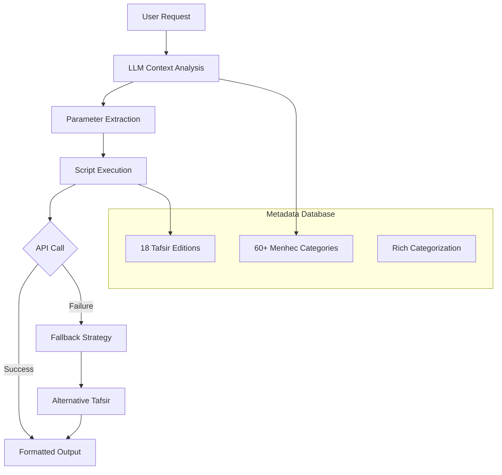

# Tafsir API Skill for OpenClaw

<div align="center">


**Intelligent Quranic Tafsir (Exegesis) Retrieval with Context-Aware Selection**

[Features](#features) • [Architecture](#architecture) • [Installation](#installation) • [Usage](#usage) • [API Reference](#api-reference) • [Contributing](#contributing)

</div>

## 📖 Overview

The **Tafsir API Skill** is an OpenClaw skill that provides intelligent access to Quranic exegesis (tafsir) texts through a REST API. It features sophisticated context analysis, rich metadata categorization, and intelligent tafsir selection based on user preferences, historical period, methodology, language, and school of thought.

This skill enables LLMs to fetch appropriate tafsir texts for any Quranic verse while considering the user's context, preferences, and requirements.

## ✨ Features

### 🎯 **Intelligent Context Analysis**
- **60+ Menhec Categories**: Historical periods, methodologies, schools of thought, languages, styles
- **User Preference Mapping**: Analyzes user context (language, school, style preferences)
- **Optimal Tafsir Selection**: Automatically selects the most appropriate tafsir based on multiple criteria

### 🔧 **Robust Technical Foundation**
- **100+ Verse Format Support**: Parses "2:16", "Bakara 255", "surah 1 verse 1", "fatiha 1", etc.
- **Multi-language Synonym Support**: Turkish/English/Arabic menhec term normalization
- **Production-Ready Features**: Caching (24h), rate limiting (1s), fallback mechanisms
- **Comprehensive Error Handling**: User-friendly messages and automatic recovery

### 📚 **Rich Metadata Integration**
- **18 Tafsir Editions**: 17 English, 1 Arabic with comprehensive metadata
- **Detailed Categorization**: Each tafsir categorized by 5-8 menhec attributes
- **Historical Context**: Period-based selection (10th-21st century works)

### 🤖 **LLM Integration & Triggering**

### How LLMs Should Use This Skill

LLMs should follow this workflow when users request tafsir:

#### 1. Parse User Request
```python
def parse_tafsir_request(user_input: str) -> dict:
    """
    Extract parameters from user input.
    
    Returns:
        dict: {
            "verse": str,           # e.g., "2:255", "Al-Baqarah 255", "1:1"
            "slug": str or None,    # specific tafsir slug if mentioned
            "menhec": str or None,  # methodology if specified
            "verbose": bool         # if user wants detailed output
        }
    """
```

#### 2. Analyze Context & Select Menhec
- **If user mentions specific tafsir**: Use `--slug` parameter
- **If user mentions methodology**: Normalize to standard menhec terms
- **If no preference**: Default to `riwayah` (narrative-based)
- **Consider user context**: Language, school, style preferences

#### 3. Build Command
```bash
# Basic structure
python3 scripts/fetch_tafsir.py --verse "{verse}" [--slug "{slug}" | --menhec "{menhec}"] [--verbose]

# Examples:
python3 scripts/fetch_tafsir.py --verse "2:255" --menhec "riwayah"
python3 scripts/fetch_tafsir.py --verse "1:1" --menhec "ishari"
python3 scripts/fetch_tafsir.py --verse "Al-Baqarah 255" --slug "en-tafisr-ibn-kathir" --verbose
```

#### 4. Execute & Format Output
- Execute the command via subprocess or OpenClaw's exec tool
- Capture output and format for user presentation
- Handle errors gracefully with user-friendly messages

### LLM Prompt Template

```
When user requests tafsir:

1. **Extract verse reference** (any format: "2:255", "Bakara 255", "surah 1 verse 1")
2. **Determine tafsir preference**:
   - If specific tafsir mentioned (Ibn Kathir, Al-Jalalayn, etc.) → use --slug
   - If methodology mentioned (mystical, narrative, jurisprudential) → normalize to menhec
   - If no preference → default to --menhec "riwayah"
3. **Consider context** (optional):
   - Language preference → add "arabic" or "english" to menhec
   - School preference → add "hanafi", "shafi", "salafi", etc.
   - Style preference → add "simplified", "modern", "classical", etc.
4. **Build command** and execute
5. **Return formatted result** to user
```

### Example LLM Implementation

```python
import subprocess
import json

def fetch_tafsir(verse: str, slug: str = None, menhec: str = None, verbose: bool = False):
    """Execute tafsir fetch command and return result."""
    cmd = ["python3", "scripts/fetch_tafsir.py", "--verse", verse]
    
    if slug:
        cmd.extend(["--slug", slug])
    elif menhec:
        cmd.extend(["--menhec", menhec])
    else:
        # Default to narrative-based tafsir
        cmd.extend(["--menhec", "riwayah"])
    
    if verbose:
        cmd.append("--verbose")
    
    try:
        result = subprocess.run(cmd, capture_output=True, text=True, timeout=30)
        if result.returncode == 0:
            return result.stdout
        else:
            return f"Error: {result.stderr}"
    except Exception as e:
        return f"Execution error: {str(e)}"

# Usage in LLM response
def handle_user_request(user_input: str):
    # Parse user input (LLM does this)
    params = parse_user_input(user_input)
    
    # Fetch tafsir
    result = fetch_tafsir(
        verse=params["verse"],
        slug=params.get("slug"),
        menhec=params.get("menhec"),
        verbose=params.get("verbose", False)
    )
    
    # Format and return to user
    return format_tafsir_result(result)
```

### OpenClaw Integration

In OpenClaw, LLMs can use the `exec` tool to run the script:

```python
# Pseudo-code for OpenClaw agent
response = exec(
    command='python3 scripts/fetch_tafsir.py --verse "2:255" --menhec "riwayah"',
    workdir='/path/to/skill/directory'
)

# Parse and format the response for user
if response.success:
    return format_tafsir_output(response.stdout)
else:
    return f"Could not fetch tafsir: {response.stderr}"
```

### Menhec Normalization Reference

| User Says | LLM Should Extract |
|-----------|-------------------|
| "narrative tafsir", "hadith-based" | `menhec="riwayah"` |
| "mystical tafsir", "allegorical" | `menhec="ishari"` |
| "rational tafsir", "jurisprudential" | `menhec="dirayah"` |
| "textual tafsir", "traditional" | `menhec="athari"` |
| "Sufi tafsir", "spiritual" | `menhec="tasawwuf"` |
| "modern tafsir", "contemporary" | `menhec="modern"` |
| "simple tafsir", "brief" | `menhec="simplified"` |
| "Arabic tafsir" | `menhec="arabic"` (plus default methodology) |
| "English tafsir" | `menhec="english"` (plus default methodology) |


## 🏗️ Architecture



### Core Components

1. **`fetch_tafsir.py`** - Main script with caching, rate limiting, and fallback
2. **`methodology_matcher.py`** - Intelligent menhec matching with 60+ categories
3. **`tafsir_metadata.json`** - Comprehensive metadata for 18 tafsir editions
4. **`llm_prompts.md`** - Context analysis guide for LLMs

## 🚀 Quick Start

### Installation for OpenClaw

OpenClaw skills are installed by copying the skill directory to the OpenClaw skills folder:

```bash
# 1. Clone the repository
git clone https://github.com/oyilmaztekin/tafsir-api-skill.git
cd tafsir-api-skill

# 2. Extract the .skill file (if using packaged version)
tar -xzf tafsir-api.skill -C /path/to/openclaw/skills/

# OR manually copy the skill directory
cp -r tafsir-api /path/to/openclaw/skills/

# Typical OpenClaw skills path on Linux/macOS:
# ~/.openclaw/skills/ or /usr/local/share/openclaw/skills/
# Check your OpenClaw installation for the correct path

# 3. Verify installation
ls -la /path/to/openclaw/skills/tafsir-api/
```

### Manual Installation (Step by Step)

```bash
# Method 1: Using the packaged .skill file
cd /path/to/openclaw/skills/
wget https://github.com/oyilmaztekin/tafsir-api-skill/raw/main/tafsir-api.skill
tar -xzf tafsir-api.skill
rm tafsir-api.skill  # Optional: remove the archive after extraction

# Method 2: Clone and copy
cd /tmp
git clone https://github.com/oyilmaztekin/tafsir-api-skill.git
cp -r tafsir-api-skill/tafsir-api /path/to/openclaw/skills/

# Method 3: Direct download and extract
cd /path/to/openclaw/skills/
curl -L https://github.com/oyilmaztekin/tafsir-api-skill/archive/main.tar.gz | tar -xz
mv tafsir-api-skill-main/tafsir-api ./
rm -rf tafsir-api-skill-main
```

### Verify Installation

```bash
# Check if skill is installed
ls -la /path/to/openclaw/skills/ | grep tafsir

# Test the skill
cd /path/to/openclaw/skills/tafsir-api
python3 scripts/fetch_tafsir.py --verse "2:255" --menhec "riwayah"

# Expected output should show tafsir text for Ayat al-Kursi
```

### Finding Your OpenClaw Skills Path

```bash
# Common locations for OpenClaw skills:
echo "Possible OpenClaw skills paths:"

# Linux/macOS user installation
echo "~/.openclaw/skills/"

# Linux system installation  
echo "/usr/local/share/openclaw/skills/"
echo "/opt/openclaw/skills/"

# macOS Homebrew installation
echo "/usr/local/opt/openclaw/skills/"
echo "/opt/homebrew/opt/openclaw/skills/"

# Check if openclaw command provides info
openclaw --help | grep -i skill || echo "Check OpenClaw documentation"
```

### Post-Installation

After installation, the skill will be available to OpenClaw agents. LLMs can now use the skill by:

1. Parsing user requests for tafsir
2. Extracting verse references and methodology preferences
3. Calling the appropriate script with correct parameters
4. Formatting and returning the results to users

### Basic Usage

```bash
# Fetch tafsir for a specific verse
python3 scripts/fetch_tafsir.py --verse "2:16"

# Specify methodology (menhec)
python3 scripts/fetch_tafsir.py --verse "Bakara 255" --menhec "ishari"

# Use specific tafsir edition
python3 scripts/fetch_tafsir.py --verse "1:1" --slug "en-tafisr-ibn-kathir"

# Get verbose output with details
python3 scripts/fetch_tafsir.py --verse "2:16" --slug "en-tafisr-ibn-kathir" --verbose
```

### LLM Integration Example

```python
# Pseudo-code for LLM integration
def handle_tafsir_request(user_input):
    # Analyze user context
    context = analyze_user_context(user_input)
    # Extract parameters
    params = extract_parameters(user_input, context)
    # Build and execute command
    result = execute_tafsir_command(params)
    return format_result(result)
```

## 📊 Tafsir Editions

The skill supports 18 tafsir editions across various categories:

| Category | Tafsir Examples | Key Characteristics |
|----------|----------------|---------------------|
| **Classical Riwayah** | Ibn Kathir, Al-Baghawi, Al-Tabari | Hadith-based, narrative-focused, 10th-14th century |
| **Modern Dirayah** | Maarif-ul-Quran, Tazkirul Quran | Rational analysis, contemporary issues, 20th century |
| **Sufi/Ishari** | Kashf al-Asrar, Al-Qushairi, Kashani | Mystical interpretation, spiritual insights |
| **Jurisprudential** | Al-Qurtubi, Maarif-ul-Quran | Legal focus, fiqh-oriented analysis |
| **Simplified** | Al-Muyassar, Al-Saddi | Brief explanations, easy understanding |

**Complete List**: See [`references/tafsir_editions.md`](references/tafsir_editions.md)

## 🎯 Menhec Categories

### Historical Periods
- `10th-century`, `12th-century`, `13th-century`, `14th-century`
- `15th-16th-century`, `20th-century`, `21st-century`
- `classical`, `modern`

### Schools of Thought
- `sunni`, `salafi`, `hanafi`, `shafi`, `maliki`, `deobandi`, `shia`

### Methodology Types
- `riwayah` (narrative), `dirayah` (rational), `ishari` (mystical), `athari` (textual)
- `tasawwuf` (Sufi), `sufism`, `hadith-based`, `jurisprudential`, `linguistic`

### Language Preferences
- `english` (English translations)
- `arabic` (Original Arabic works)

### Style & Approach
- `simplified`, `brief-explanation`, `concise-literal`
- `reflective`, `contemplative-dirayah`, `encyclopedic`

## 🔍 Usage Examples

### Example 1: Simple Verse Request (Default Methodology)
```
User: "Get tafsir for 2:255"

LLM Analysis:
- Verse: "2:255" → surah=2, ayah=255
- No methodology specified → default to riwayah (narrative-based)
- Menhec: riwayah (default)

Command: python3 scripts/fetch_tafsir.py --verse "2:255" --menhec "riwayah"
Result: en-tafisr-ibn-kathir (riwayah, athari, hadith-based)
```

### Example 2: Verse with Mystical Interpretation
```
User: "Find mystical tafsir for 1:1"

LLM Analysis:
- Verse: "1:1" → surah=1, ayah=1
- Methodology: "mystical" → ishari (mystical/allegorical)
- Menhec: ishari

Command: python3 scripts/fetch_tafsir.py --verse "1:1" --menhec "ishari"
Result: en-kashf-al-asrar-tafsir (ishari, sufi-mystical, mystical-linguistic)
```

### Example 3: Specific Tafsir Edition Request
```
User: "Ibn Kathir tafsir for Al-Baqarah 255"

LLM Analysis:
- Verse: "Al-Baqarah 255" → surah=2, ayah=255
- Specific edition: "Ibn Kathir" → slug: en-tafisr-ibn-kathir
- Command uses slug instead of menhec

Command: python3 scripts/fetch_tafsir.py --verse "Al-Baqarah 255" --slug "en-tafisr-ibn-kathir"
Result: en-tafisr-ibn-kathir (direct slug selection)
```

### Example 4: Narrative and Hadith-Based Tafsir
```
User: "Narrative and hadith-based tafsir for 2:16"

LLM Analysis:
- Verse: "2:16" → surah=2, ayah=16
- Methodology: "narrative and hadith-based" → riwayah, hadith-based
- Menhec: riwayah, hadith-based

Command: python3 scripts/fetch_tafsir.py --verse "2:16" --menhec "riwayah hadith-based"
Result: en-tafisr-ibn-kathir (riwayah, hadith-based, athari)
```

### Example 5: Modern Simplified Tafsir
```
User: "Modern simple tafsir for 36:1"

LLM Analysis:
- Verse: "36:1" → surah=36, ayah=1
- Style: "modern simple" → modern, simplified
- Menhec: modern, simplified

Command: python3 scripts/fetch_tafsir.py --verse "36:1" --menhec "modern simplified"
Result: ar-tafsir-muyassar (21st-century, simplified, brief-explanation)
```

### Example 6: Hanafi Jurisprudential Tafsir
```
User: "Hanafi jurisprudential tafsir for 4:34"

LLM Analysis:
- Verse: "4:34" → surah=4, ayah=34
- School: "Hanafi" → hanafi
- Focus: "jurisprudential" → jurisprudential
- Menhec: hanafi, jurisprudential

Command: python3 scripts/fetch_tafsir.py --verse "4:34" --menhec "hanafi jurisprudential"
Result: en-tafsir-maarif-ul-quran (hanafi, jurisprudential, socio-moral)
```

### Example 7: Classical Narrative Tafsir for Academic Use
```
User: "Classical narrative tafsir for 18:18 for academic research"

LLM Analysis:
- Verse: "18:18" → surah=18, ayah=18
- Period: "classical" → classical
- Methodology: "narrative" → riwayah
- Purpose: "academic research" → comprehensive, authoritative
- Menhec: classical, riwayah, encyclopedic

Command: python3 scripts/fetch_tafsir.py --verse "18:18" --menhec "classical riwayah encyclopedic"
Result: ar-tafsir-al-tabari (10th-century, riwayah-foundational, encyclopedic)
```

### Example 8: Sufi Tafsir for Spiritual Meaning
```
User: "Sufi tafsir for 55:1-3 with spiritual meanings"

LLM Analysis:
- Verse: "55:1-3" → surah=55, ayah=1-3 (script handles range)
- Methodology: "Sufi" → tasawwuf, ishari
- Focus: "spiritual meanings" → spiritual-allusions
- Menhec: ishari, tasawwuf, spiritual-allusions

Command: python3 scripts/fetch_tafsir.py --verse "55:1-3" --menhec "ishari tasawwuf spiritual-allusions"
Result: en-al-qushairi-tafsir (ishari, tasawwuf, spiritual-allusions)
```

### Example 9: Arabic Language Tafsir
```
User: "Arabic tafsir for Ayat al-Kursi (2:255)"

LLM Analysis:
- Verse: "2:255" → surah=2, ayah=255
- Language: "Arabic" → arabic
- Menhec: arabic, riwayah (default for Arabic)

Command: python3 scripts/fetch_tafsir.py --verse "2:255" --menhec "arabic riwayah"
Result: ar-tafsir-ibn-kathir (arabic, riwayah, hadith-comprehensive)
```

### Example 10: Salafi-Oriented Simple Tafsir
```
User: "Simple Salafi-oriented tafsir for 23:1-11"

LLM Analysis:
- Verse: "23:1-11" → surah=23, ayah=1-11
- School: "Salafi-oriented" → salafi
- Style: "simple" → simplified
- Menhec: salafi, simplified

Command: python3 scripts/fetch_tafsir.py --verse "23:1-11" --menhec "salafi simplified"
Result: ar-tafseer-al-saddi (salafi, simplified, brief-explanation)
```

## 📁 Project Structure

```
tafsir-api-skill/
├── README.md                          # This file
├── SKILL.md                           # OpenClaw skill documentation
├── scripts/
│   ├── fetch_tafsir.py               # Main script (caching, fallback, rate limiting)
│   ├── methodology_matcher.py        # Intelligent menhec matching
│   ├── test_fetch_tafsir.py          # Basic test suite
│   └── test_extended.py              # Extended test suite
└── references/
    ├── tafsir_metadata.json          # 18 tafsir metadata (rich categorization)
    ├── api_reference.md              # API documentation
    ├── tafsir_editions.md            # Tafsir descriptions
    └── llm_prompts.md                # LLM context analysis guide
```

## 🔧 API Reference

### Base URL
```
https://cdn.jsdelivr.net/gh/spa5k/tafsir_api@main/tafsir/
```

### Fallback URL
```
https://raw.githubusercontent.com/spa5k/tafsir_api/main/tafsir/
```

### Available Tafsir Slugs
- `en-tafisr-ibn-kathir` - Tafsir Ibn Kathir (abridged)
- `ar-tafsir-ibn-kathir` - Tafsir Ibn Kathir (Arabic)
- `en-tafsir-maarif-ul-quran` - Maarif-ul-Quran
- `ar-tafseer-al-saddi` - Tafseer Al Saddi
- `ar-tafsir-al-baghawi` - Tafseer Al-Baghawi
- ... and 13 more (see references/tafsir_editions.md)

### Response Format
```json
{
  "text": "Tafsir text content...",
  "surah": 2,
  "ayah": 16,
  "tafsir_name": "Tafsir Ibn Kathir (abridged)",
  "author": "Hafiz Ibn Kathir",
  "source": "API endpoint"
}
```

## 🧪 Testing

Run the comprehensive test suite:

```bash
# Basic tests
python3 scripts/test_fetch_tafsir.py

# Extended tests (menhec combinations, context analysis)
python3 scripts/test_extended.py

# Individual component tests
python3 -c "from methodology_matcher import normalize_menhec; print(normalize_menhec('rivayet'))"
```

## 🤝 Contributing

We welcome contributions! Here's how you can help:

1. **Report Issues**: Found a bug? Open an issue with detailed description
2. **Suggest Features**: Have an idea? Share it in the discussions
3. **Submit PRs**: 
   - Add new tafsir editions to metadata
   - Improve menhec categorization
   - Enhance context analysis algorithms
   - Add tests for edge cases

### Development Setup

```bash
# Fork and clone
git clone https://github.com/your-username/tafsir-api-skill.git
cd tafsir-api-skill

# Create virtual environment
python3 -m venv venv
source venv/bin/activate  # On Windows: venv\Scripts\activate

# Install dependencies
pip install -r requirements.txt

# Run tests
python3 scripts/test_fetch_tafsir.py
python3 scripts/test_extended.py
```

## 📄 License

This project is licensed under the MIT License - see the [LICENSE](LICENSE) file for details.

## 🙏 Acknowledgments

- **Tafsir API**: Thanks to [spa5k](https://github.com/spa5k/tafsir_api) for providing the tafsir data
- **OpenClaw Community**: For the amazing platform and support
- **Islamic Scholarship**: To the scholars whose works make this project possible

## 📞 Support

- **Issues**: [GitHub Issues](https://github.com/oyilmaztekin/tafsir-api-skill/issues)
- **Discussions**: [GitHub Discussions](https://github.com/oyilmaztekin/tafsir-api-skill/discussions)
- **OpenClaw Community**: [Discord](https://discord.com/invite/clawd)

---

<div align="center">

**Made with ❤️ for the OpenClaw community**

</div>