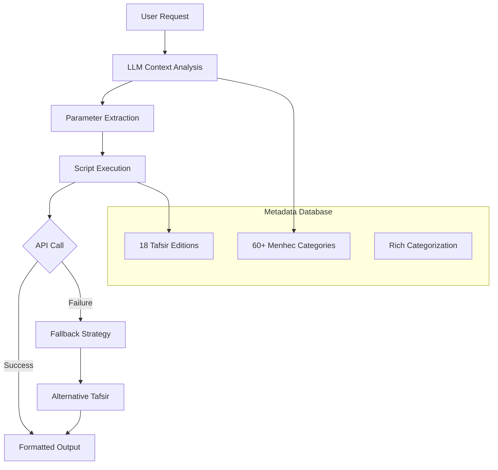

# Tafsir API Skill for OpenClaw

<div align="center">


**Intelligent Quranic Tafsir (Exegesis) Retrieval with Context-Aware Selection**

[Features](#features) • [Architecture](#architecture) • [Installation](#installation) • [Usage](#usage) • [API Reference](#api-reference) • [Contributing](#contributing)

</div>

## 📖 Overview

The **Tafsir API Skill** is an OpenClaw skill that provides intelligent access to Quranic exegesis (tafsir) texts through a REST API. It features sophisticated context analysis, rich metadata categorization, and intelligent tafsir selection based on user preferences, historical period, methodology, language, and school of thought.

This skill enables LLMs to fetch appropriate tafsir texts for any Quranic verse while considering the user's context, preferences, and requirements.

## ✨ Features

### 🎯 **Intelligent Context Analysis**
- **60+ Menhec Categories**: Historical periods, methodologies, schools of thought, languages, styles
- **User Preference Mapping**: Analyzes user context (language, school, style preferences)
- **Optimal Tafsir Selection**: Automatically selects the most appropriate tafsir based on multiple criteria

### 🔧 **Robust Technical Foundation**
- **100+ Verse Format Support**: Parses "2:16", "Bakara 255", "surah 1 verse 1", "fatiha 1", etc.
- **Multi-language Synonym Support**: Turkish/English/Arabic menhec term normalization
- **Production-Ready Features**: Caching (24h), rate limiting (1s), fallback mechanisms
- **Comprehensive Error Handling**: User-friendly messages and automatic recovery

### 📚 **Rich Metadata Integration**
- **18 Tafsir Editions**: 17 English, 1 Arabic with comprehensive metadata
- **Detailed Categorization**: Each tafsir categorized by 5-8 menhec attributes
- **Historical Context**: Period-based selection (10th-21st century works)

### 🤖 **LLM-Optimized Design**
- **Two-Layer Synonym Handling**: LLM handles normalization, script provides fallback
- **Context-Aware Prompts**: LLM can analyze user intent and select optimal parameters
- **Semantic Understanding**: Natural language parsing for verse references and preferences

## 🏗️ Architecture



### Core Components

1. **`fetch_tafsir.py`** - Main script with caching, rate limiting, and fallback
2. **`methodology_matcher.py`** - Intelligent menhec matching with 60+ categories
3. **`tafsir_metadata.json`** - Comprehensive metadata for 18 tafsir editions
4. **`llm_prompts.md`** - Context analysis guide for LLMs

## 🚀 Quick Start

### Installation

```bash
# Clone the repository
git clone https://github.com/oyilmaztekin/tafsir-api-skill.git
cd tafsir-api-skill

# Install as OpenClaw skill
openclaw skills install .
```

### Basic Usage

```bash
# Fetch tafsir for a specific verse
python3 scripts/fetch_tafsir.py --verse "2:16"

# Specify methodology (menhec)
python3 scripts/fetch_tafsir.py --verse "Bakara 255" --menhec "ishari"

# Use specific tafsir edition
python3 scripts/fetch_tafsir.py --verse "1:1" --slug "en-tafisr-ibn-kathir"

# Get verbose output with details
python3 scripts/fetch_tafsir.py --verse "2:16" --slug "en-tafisr-ibn-kathir" --verbose
```

### LLM Integration Example

```python
# Pseudo-code for LLM integration
def handle_tafsir_request(user_input):
    # Analyze user context
    context = analyze_user_context(user_input)
    # Extract parameters
    params = extract_parameters(user_input, context)
    # Build and execute command
    result = execute_tafsir_command(params)
    return format_result(result)
```

## 📊 Tafsir Editions

The skill supports 18 tafsir editions across various categories:

| Category | Tafsir Examples | Key Characteristics |
|----------|----------------|---------------------|
| **Classical Riwayah** | Ibn Kathir, Al-Baghawi, Al-Tabari | Hadith-based, narrative-focused, 10th-14th century |
| **Modern Dirayah** | Maarif-ul-Quran, Tazkirul Quran | Rational analysis, contemporary issues, 20th century |
| **Sufi/Ishari** | Kashf al-Asrar, Al-Qushairi, Kashani | Mystical interpretation, spiritual insights |
| **Jurisprudential** | Al-Qurtubi, Maarif-ul-Quran | Legal focus, fiqh-oriented analysis |
| **Simplified** | Al-Muyassar, Al-Saddi | Brief explanations, easy understanding |

**Complete List**: See [`references/tafsir_editions.md`](references/tafsir_editions.md)

## 🎯 Menhec Categories

### Historical Periods
- `10th-century`, `12th-century`, `13th-century`, `14th-century`
- `15th-16th-century`, `20th-century`, `21st-century`
- `classical`, `modern`

### Schools of Thought
- `sunni`, `salafi`, `hanafi`, `shafi`, `maliki`, `deobandi`, `shia`

### Methodology Types
- `riwayah` (narrative), `dirayah` (rational), `ishari` (mystical), `athari` (textual)
- `tasawwuf` (Sufi), `sufism`, `hadith-based`, `jurisprudential`, `linguistic`

### Language Preferences
- `english` (English translations)
- `arabic` (Original Arabic works)

### Style & Approach
- `simplified`, `brief-explanation`, `concise-literal`
- `reflective`, `contemplative-dirayah`, `encyclopedic`

## 🔍 Usage Examples

### Example 1: Turkish User Request
```
User: "Türkçe okuyacağım, modern ve sade bir tefsir istiyorum"

LLM Analysis:
- Language: Turkish → prefers Arabic or English
- Style: "modern ve sade" → modern, simplified
- Menhec: modern, simplified, arabic

Command: python3 scripts/fetch_tafsir.py --verse "{verse}" --menhec "modern simplified"
Result: ar-tafsir-muyassar (21st-century, simplified, brief-explanation)
```

### Example 2: Hanafi Fiqh Student
```
User: "Hanefi mezhebine uygun fıkhi tefsir"

LLM Analysis:
- School: hanafi
- Focus: jurisprudential, legal-focus
- Menhec: hanafi, jurisprudential

Command: python3 scripts/fetch_tafsir.py --verse "{verse}" --menhec "hanafi jurisprudential"
Result: en-tafsir-maarif-ul-quran (hanafi, deobandi, jurisprudential)
```

### Example 3: Academic Research
```
User: "Akademik araştırma için klasik dönem rivayet tefsiri"

LLM Analysis:
- Purpose: Academic → authoritative, comprehensive
- Period: classical, 14th-century
- Methodology: riwayah, hadith-comprehensive
- Menhec: classical, riwayah, hadith-comprehensive

Command: python3 scripts/fetch_tafsir.py --verse "{verse}" --menhec "classical riwayah hadith-comprehensive"
Result: ar-tafsir-ibn-kathir (14th-century, riwayah, hadith-comprehensive)
```

### Example 4: Spiritual Seeker
```
User: "Manevi anlamlar için tasavvufi tefsir"

LLM Analysis:
- Focus: Spiritual meanings
- Methodology: ishari, tasawwuf
- Menhec: ishari, tasawwuf

Command: python3 scripts/fetch_tafsir.py --verse "{verse}" --menhec "ishari tasawwuf"
Result: en-kashf-al-asrar-tafsir (ishari, tasawwuf, mystical-linguistic)
```

## 📁 Project Structure

```
tafsir-api-skill/
├── README.md                          # This file
├── SKILL.md                           # OpenClaw skill documentation
├── scripts/
│   ├── fetch_tafsir.py               # Main script (caching, fallback, rate limiting)
│   ├── methodology_matcher.py        # Intelligent menhec matching
│   ├── test_fetch_tafsir.py          # Basic test suite
│   └── test_extended.py              # Extended test suite
└── references/
    ├── tafsir_metadata.json          # 18 tafsir metadata (rich categorization)
    ├── api_reference.md              # API documentation
    ├── tafsir_editions.md            # Tafsir descriptions
    └── llm_prompts.md                # LLM context analysis guide
```

## 🔧 API Reference

### Base URL
```
https://cdn.jsdelivr.net/gh/spa5k/tafsir_api@main/tafsir/
```

### Fallback URL
```
https://raw.githubusercontent.com/spa5k/tafsir_api/main/tafsir/
```

### Available Tafsir Slugs
- `en-tafisr-ibn-kathir` - Tafsir Ibn Kathir (abridged)
- `ar-tafsir-ibn-kathir` - Tafsir Ibn Kathir (Arabic)
- `en-tafsir-maarif-ul-quran` - Maarif-ul-Quran
- `ar-tafseer-al-saddi` - Tafseer Al Saddi
- `ar-tafsir-al-baghawi` - Tafseer Al-Baghawi
- ... and 13 more (see references/tafsir_editions.md)

### Response Format
```json
{
  "text": "Tafsir text content...",
  "surah": 2,
  "ayah": 16,
  "tafsir_name": "Tafsir Ibn Kathir (abridged)",
  "author": "Hafiz Ibn Kathir",
  "source": "API endpoint"
}
```

## 🧪 Testing

Run the comprehensive test suite:

```bash
# Basic tests
python3 scripts/test_fetch_tafsir.py

# Extended tests (menhec combinations, context analysis)
python3 scripts/test_extended.py

# Individual component tests
python3 -c "from methodology_matcher import normalize_menhec; print(normalize_menhec('rivayet'))"
```

## 🤝 Contributing

We welcome contributions! Here's how you can help:

1. **Report Issues**: Found a bug? Open an issue with detailed description
2. **Suggest Features**: Have an idea? Share it in the discussions
3. **Submit PRs**: 
   - Add new tafsir editions to metadata
   - Improve menhec categorization
   - Enhance context analysis algorithms
   - Add tests for edge cases

### Development Setup

```bash
# Fork and clone
git clone https://github.com/your-username/tafsir-api-skill.git
cd tafsir-api-skill

# Create virtual environment
python3 -m venv venv
source venv/bin/activate  # On Windows: venv\Scripts\activate

# Install dependencies
pip install -r requirements.txt

# Run tests
python3 scripts/test_fetch_tafsir.py
python3 scripts/test_extended.py
```

## 📄 License

This project is licensed under the MIT License - see the [LICENSE](LICENSE) file for details.

## 🙏 Acknowledgments

- **Tafsir API**: Thanks to [spa5k](https://github.com/spa5k/tafsir_api) for providing the tafsir data
- **OpenClaw Community**: For the amazing platform and support
- **Islamic Scholarship**: To the scholars whose works make this project possible

## 📞 Support

- **Issues**: [GitHub Issues](https://github.com/oyilmaztekin/tafsir-api-skill/issues)
- **Discussions**: [GitHub Discussions](https://github.com/oyilmaztekin/tafsir-api-skill/discussions)
- **OpenClaw Community**: [Discord](https://discord.com/invite/clawd)

## 📈 Roadmap

- [ ] Add more tafsir editions (Turkish, Urdu, other languages)
- [ ] Implement advanced caching strategies
- [ ] Add user preference profiles
- [ ] Develop browser extension for quick access
- [ ] Create mobile app interface
- [ ] Add audio tafsir support

---

<div align="center">

**Made with ❤️ for the OpenClaw community**

[](https://star-history.com/#oyilmaztekin/tafsir-api-skill&Date)

</div>