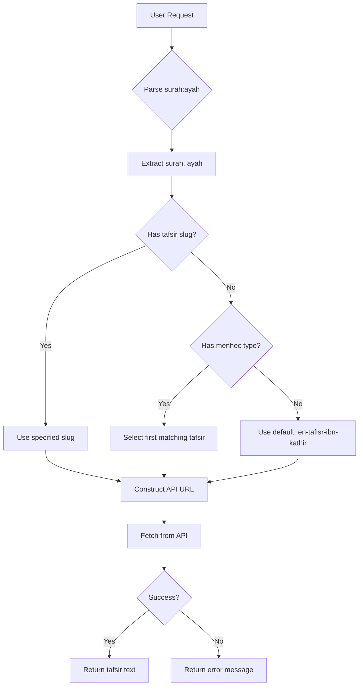

# Tefsir API Skill

## Overview

This skill enables fetching Quranic tafsir (exegesis) texts from various classical and modern commentaries via a REST API. Users can request tafsir for specific Quran verses by providing surah number, ayah number, and optionally a tafsir edition slug or methodology (menhec) type. The skill supports 10+ tafsir editions in English, covering different methodological approaches (riwayah/narrative-based, dirayah/jurisprudential, ishari/mystical).

## Quick Start

To fetch tafsir for a Quran verse:

1. **Parse user request** for surah:ayah format (e.g., "2:16", "Bakara 255", "fatiha 1")
2. **Extract parameters**: surah number, ayah number, optional tafsir slug or menhec
3. **Determine tafsir slug**: Use specified slug or select based on menhec type
4. **Call API**: `https://cdn.jsdelivr.net/gh/spa5k/tafsir_api@main/tafsir/{slug}/{surah}/{ayah}.json`
5. **Return result**: JSON with `surah`, `ayah`, and `text` fields

## User Input Parsing

### Supported Input Formats
The skill can parse various verse input formats:

#### 1. Colon Format (Most Common)
- `"2:16"` → Surah 2, Ayah 16
- `"1:1"` → Surah 1, Ayah 1
- `"114:3"` → Surah 114, Ayah 3

#### 2. Surah Name Format
- `"Bakara 255"` → Surah 2, Ayah 255
- `"fatiha 1"` → Surah 1, Ayah 1
- `"Yasin 1"` → Surah 36, Ayah 1
- `"Al-Baqarah 255"` → Surah 2, Ayah 255

#### 3. Explicit Format
- `"surah 2 ayah 16"` → Surah 2, Ayah 16
- `"surah 1 verse 1"` → Surah 1, Ayah 1

#### 4. With Tafsir Specification
- `"2:16, ibn kesir"` → Surah 2:16 with Ibn Kathir tafsir
- `"Bakara 255, menhec ishari"` → Surah 2:255 with ishari methodology
- `"fatiha 1, en-al-jalalayn"` → Surah 1:1 with Al-Jalalayn tafsir

### Supported Surah Names
The skill recognizes many surah names in various formats:
- **English:** "The Opening", "The Cow", "The Family of Imran"
- **Arabic transliteration:** "Al-Fatiha", "Al-Baqarah", "Ali 'Imran"
- **Turkish:** "Fatiha", "Bakara", "Ali İmran"
- **Common abbreviations:** "Fatiha", "Bakara", "Yasin", "Rahman"

See `scripts/fetch_tafsir.py` for complete surah name mapping.

## Usage Examples

### Example 1: Specific Tafsir Edition
- **User:** "2:16, ibn kesir"
- **Parsed:** Surah 2, Ayah 16, Tafsir Ibn Kathir
- **Action:** Fetch Ibn Kathir tafsir for Surah 2, Ayah 16
- **API:** `https://cdn.jsdelivr.net/gh/spa5k/tafsir_api@main/tafsir/en-tafisr-ibn-kathir/2/16.json`
- **Fallback:** If not found, try other riwayah tafsirs

### Example 2: By Methodology (Menhec)
- **User:** "Bakara 255, menhec ishari"
- **Parsed:** Surah 2, Ayah 255, ishari methodology
- **Action:** Fetch ishari/mystical tafsir for Surah 2, Ayah 255
- **Selection:** Choose Kashf Al-Asrar Tafsir (ishari methodology)
- **API:** `https://cdn.jsdelivr.net/gh/spa5k/tafsir_api@main/tafsir/en-kashf-al-asrar-tafsir/2/255.json`
- **Fallback:** Try other ishari tafsirs (Al-Qushairi, Kashani, Tustari)

### Example 3: Default/Riwayah Methodology
- **User:** "fatiha 1, menhec=riwayah"
- **Parsed:** Surah 1, Ayah 1, riwayah methodology
- **Action:** Fetch riwayah/narrative-based tafsir for Surah 1, Ayah 1
- **Selection:** Choose Ibn Kathir or Ibn Abbas (both riwayah)
- **API:** `https://cdn.jsdelivr.net/gh/spa5k/tafsir_api@main/tafsir/en-tafisr-ibn-kathir/1/1.json`

### Example 4: Turkish Input
- **User:** "Bakara 255, rivayet tefsiri"
- **Parsed:** Surah 2, Ayah 255, riwayah methodology (Turkish: rivayet)
- **Action:** Fetch riwayah tafsir for Surah 2, Ayah 255
- **Normalization:** "rivayet" → "riwayah"
- **API:** `https://cdn.jsdelivr.net/gh/spa5k/tafsir_api@main/tafsir/en-tafisr-ibn-kathir/2/255.json`

### Example 5: With Fallback
- **User:** "18:1, en-kashf-al-asrar-tafsir" (but this tafsir doesn't cover Surah 18)
- **Action:** Try primary tafsir → not found → fallback to other ishari tafsirs
- **Result:** Returns Al-Qushairi or Kashani tafsir instead

## API Details

### URL Format
```
https://cdn.jsdelivr.net/gh/spa5k/tafsir_api@main/tafsir/{slug}/{surah}/{ayah}.json
```

### Parameters
- `slug`: Tafsir edition identifier (e.g., "en-tafisr-ibn-kathir")
- `surah`: Surah number (1-114)
- `ayah`: Ayah number (verse number within surah)

### Response Format (Success)
```json
{
  "surah": 1,
  "ayah": 1,
  "text": "In the Name of God the Compassionate the Merciful"
}
```

### Error Handling

#### Common Error Types
| Error Type | HTTP Code | Cause | User-Friendly Message |
|------------|-----------|-------|----------------------|
| `not_found` | 404 | Tafsir not available for surah/ayah | "Tafsir not available for Surah {surah}:{ayah} in {tafsir_name}. Try a different tafsir edition." |
| `network_error` | - | Connection issues | "Network error. Check your internet connection and try again." |
| `http_error` | 500 | Server error | "API server error. Please try again later." |
| `invalid_json` | 200 | Malformed response | "Invalid response from server. The tafsir data might be corrupted." |

#### Fallback Strategy
When a tafsir is not found, the skill automatically tries alternative tafsirs:
1. Same methodology (menhec) tafsirs
2. Similar methodology tafsirs
3. Default tafsir (Ibn Kathir)

#### Rate Limiting and Caching
- **Rate limiting**: Minimum 1 second between API requests
- **Caching**: Responses cached for 24 hours
- **Fallback URLs**: Alternate CDN URL if primary fails
- **Retry logic**: Exponential backoff for network errors

#### User Input Validation
- Validate surah numbers (1-114)
- Validate ayah numbers (check reasonable ranges)
- Validate tafsir slugs against known editions
- Normalize menhec inputs (Turkish/English/Arabic variations supported)

## Supported Tafsir Editions

The skill supports 10 tafsir editions in English. Each has a unique slug and methodology (menhec) classification:

| Tafsir Name | Slug | Methodology (Menhec) | Description |
|-------------|------|---------------------|-------------|
| Tafsir Ibn Kathir (abridged) | `en-tafisr-ibn-kathir` | `athari`, `riwayah`, `hadith-based`, `canonical` | Classical narrative-based exegesis |
| Maarif-ul-Quran | `en-tafsir-maarif-ul-quran` | `dirayah`, `jurisprudential`, `socio-moral`, `modernist-traditional` | Jurisprudential and moral commentary |
| Tazkirul Quran | `en-tazkirul-quran` | `dirayah`, `reflective`, `peace-oriented`, `da'wah-focused` | Reflective and peace-oriented |
| Kashf Al-Asrar Tafsir | `en-kashf-al-asrar-tafsir` | `ishari`, `sufi-mystical`, `linguistic`, `spiritual-exegesis` | Sufi mystical interpretation |
| Al Qushairi Tafsir | `en-al-qushairi-tafsir` | `ishari`, `tasawwuf`, `spiritual-allusions`, `kalam` | Sufi spiritual commentary |
| Kashani Tafsir | `en-kashani-tafsir` | `ishari`, `tasawwuf`, `philosophical-mysticism`, `irfan` | Philosophical-mystical |
| Tafsir al-Tustari | `en-tafsir-al-tustari` | `ishari`, `early-sufi`, `spiritual-significance` | Early Sufi exegesis |
| Asbab Al-Nuzul by Al-Wahidi | `en-asbab-al-nuzul-by-al-wahidi` | `riwayah`, `asbab-al-nuzul`, `occasions-of-revelation`, `historical-context` | Occasions of revelation |
| Tafsir Ibn Abbas | `en-tafsir-ibn-abbas` | `riwayah`, `narrative-based`, `early-tradition` | Early companion narrative |
| Al-Jalalayn | `en-al-jalalayn` | `dirayah`, `concise-literal`, `linguistic`, `classical-manual` | Concise classical manual |

## Menhec (Methodology) Matching

When user specifies a menhec type but not a specific tafsir, select the first matching tafsir:

### Menhec Types and Priority Order
1. **`riwayah`** (narrative-based): `en-tafisr-ibn-kathir` → `en-asbab-al-nuzul-by-al-wahidi` → `en-tafsir-ibn-abbas`
2. **`dirayah`** (jurisprudential/rational): `en-tafsir-maarif-ul-quran` → `en-tazkirul-quran` → `en-al-jalalayn`
3. **`ishari`** (mystical/allegorical): `en-kashf-al-asrar-tafsir` → `en-al-qushairi-tafsir` → `en-kashani-tafsir` → `en-tafsir-al-tustari`
4. **`athari`** (textual/traditional): `en-tafisr-ibn-kathir`
5. **`tasawwuf`** (Sufi): `en-al-qushairi-tafsir` → `en-kashani-tafsir`

### Default Selection
If no menhec or slug specified, default to `en-tafisr-ibn-kathir` (most widely used).

## Workflow Decision Tree



## Scripts

### `fetch_tafsir.py`
Main script for fetching tafsir from API. Handles parameter parsing, menhec matching, API calls, and error handling.

**Usage:**
```bash
python3 scripts/fetch_tafsir.py --surah 2 --ayah 16 --slug en-tafisr-ibn-kathir
python3 scripts/fetch_tafsir.py --surah 1 --ayah 1 --menhec riwayah
```

**Functions:**
- `parse_verse_input()`: Parse "2:16", "Bakara 255", "fatiha 1" formats
- `select_tafsir_by_menhec()`: Choose tafsir slug based on methodology
- `fetch_tafsir()`: Make API request and handle errors
- `format_output()`: Format result for display

### `methodology_matcher.py`
Utility for matching menhec types to appropriate tafsir editions.

**Usage:**
```python
from methodology_matcher import get_tafsir_for_menhec
slug = get_tafsir_for_menhec("riwayah")  # Returns "en-tafisr-ibn-kathir"
```

## References

### `tafsir_editions.md`
Complete list of all supported tafsir editions with detailed metadata:
- Full author names and biographies
- Publication details
- Methodological approaches
- Sample texts
- Coverage (which surahs/ayahs available)

### `api_reference.md`
Detailed API documentation:
- Endpoint specifications and examples
- Rate limits and quotas
- Caching strategies
- Alternative endpoints
- Common error scenarios and solutions
- Performance optimization tips

### `llm_prompts.md`
Guidelines for LLMs on parsing user requests:
- Natural language patterns to recognize
- Parameter extraction strategies
- Command building examples
- Error handling recommendations
- Integration best practices
